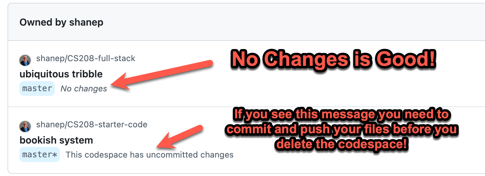

# CS208-full-stack

This is a full-stack application for CS208, built with Node.js, Express, and MariaDB (MySQL). It serves as a template for developing web applications using modern JavaScript practices. Please read the following instructions carefully because some of the setup only needs to be done once. If you are experiencing problems, please refer to the troubleshooting section before requesting assistance or rerunning the setup scripts.

# Database Setup

To set up the database, run the `install_db.sh` script. This script will install MariaDB and start the server running. You only need to run this script once per Codespace.


```bash
./setup_scripts/install_db.sh
```

Use the following for questions that the script asks:

- Switch to unix_socket authentication [Y/n] n
- Change the root password? [Y/n] Y
  - Set the password to 12345
- Remove anonymous users? [Y/n] Y
- Disallow root login remotely? [Y/n] Y
- Remove test database and access to it? [Y/n] Y
- Reload privilege tables now? [Y/n] Y

Test to make sure the db is running:

```bash
sudo service mariadb status
```

You should see something similar to what is shown below.
```
* /usr/bin/mariadb-admin  Ver 10.0 Distrib 10.11.13-MariaDB, for debian-linux-gnu on x86_64
Copyright (c) 2000, 2018, Oracle, MariaDB Corporation Ab and others.

Server version          10.11.13-MariaDB-0ubuntu0.24.04.1
Protocol version        10
Connection              Localhost via UNIX socket
UNIX socket             /run/mysqld/mysqld.sock
Uptime:                 10 min 23 sec

Threads: 1  Questions: 90  Slow queries: 0  Opens: 33  Open tables: 26  Queries per second avg: 0.144
```

Create the initial tables:

```bash
sudo mysql -u root -p < ./setup_scripts/create_demo_table.sql
```

Refer to the create_demo_table.sql file for details about the table and its fields. 


Check to make sure the tables were created correctly
```bash
mysql -u root -p -e 'show databases;'
```

```
Enter password: 
+--------------------+
| Database           |
+--------------------+
| cs208demo          |
| information_schema |
| mysql              |
| performance_schema |
| sys                |
+--------------------+
```


# Node.js Setup

To get debugging, run the command below in a [debug terminal](https://code.visualstudio.com/docs/nodejs/nodejs-debugging#_javascript-debug-terminal) instead of a regular terminal.

Run the following commands to set up the project:

```bash
npm install
npm start
```

# Troubleshooting

## Database User and Password

If you are having issues connecting to the database, ensure that you have set the correct user and password in the `db.js` file. If you have set up a different user and password, you will need to update the' db.js' file accordingly. If you have used all the setup scripts out of the box you should not have to change anything.


## Make sure the Database is installed and Running

If you encounter issues with the database, you can check the status of the MariaDB service using the command below. If the service is not running, you can start it with `sudo service mariadb start`. If the mariadb service is not installed, you can run the `install_db.sh` script again to reinstall it.

```bash
@shanep ➜ /workspaces/CS208-full-stack (master) $ sudo service mariadb status
 * /usr/bin/mariadb-admin  Ver 10.0 Distrib 10.11.13-MariaDB, for debian-linux-gnu on x86_64
Copyright (c) 2000, 2018, Oracle, MariaDB Corporation Ab and others.

Server version          10.11.13-MariaDB-0ubuntu0.24.04.1
Protocol version        10
Connection              Localhost via UNIX socket
UNIX socket             /run/mysqld/mysqld.sock
Uptime:                 10 min 23 sec

Threads: 1  Questions: 90  Slow queries: 0  Opens: 33  Open tables: 26  Queries per second avg: 0.144
```

## Check that the demo database is created

You can check if the demo database is created by running the following command in the MariaDB shell if you don't see a `cs208demo` database listed in the output of the command below, you can run the `create_demo_table.sql` script to create it.

```bash
@shanep ➜ /workspaces/CS208-full-stack (master) $ mysql -u root -p -e 'show databases;'
Enter password:
+--------------------+
| Database           |
+--------------------+
| cs208demo          |
| demo               |
| information_schema |
| mysql              |
| performance_schema |
| sys                |
+--------------------+
```

## HELP! I have tried everything and it still doesn't work!

If you have tried everything and it still doesn't work you may have accidentally changed something. It is very difficult to troubleshoot issues without knowing what you have changed. The only option is to delete your Codespace and create a new one. This will reset everything to the original state. You can do this by clicking on the "Delete Codespace" button in the Codespaces dashboard.

Follow these steps to delete your Codespace:

1. Make sure you have committed all your changes and pushed them to GitHub.
2. Go to the [Codespaces dashboard](https://github.com/codespaces).

3. Find your Codespace in the list and click on the "Delete" button next to it.
4. Confirm the deletion.
5. Create a new Codespace from the same repository and try again!
